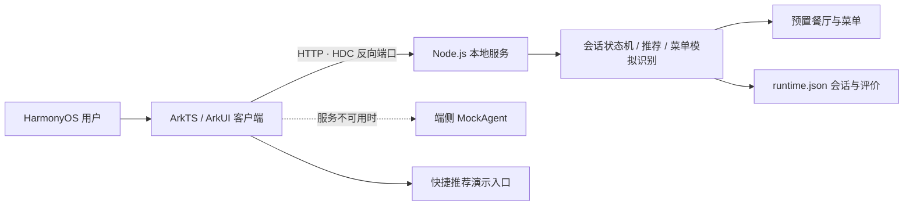

# 系统架构

## 单一应用接口

端侧所有业务动作都调用 `POST /v1/agent/execute`，请求和响应分别对应 ArkTS 的 `AgentRequest` 与 `AgentResponse`。动作包括：

- `discover` / `chat`：读取预置商家并按用户描述推荐。
- `select_restaurant`：绑定当前餐厅。
- `arrive`：读取预置菜单，或进入菜单上传阶段。
- `upload_menu`：返回演示识别数据及菜品建议。
- `finish_meal` / 评价消息：进入评价阶段并保存结果。

服务端状态按 `PRE_MEAL → RESTAURANT_SELECTED → ARRIVED/MENU_READY → DINING → REVIEW → END` 推进。端侧每次把上一次响应中的 session state 原样带回，服务端据此继续同一轮用餐。

## 数据边界

| 数据 | 演示来源 | 约束 |
|---|---|---|
| 餐厅、地址、价格、营业状态 | `server/src/seed-data.js` | 不由模型临时编造 |
| 菜单与食材 | 预置菜单或演示识别器 | 低置信度需要提示 |
| 推荐 | 确定性筛选与排序 | 理由仅使用已有字段和用户偏好 |
| 评论 | 用户输入 | 保存前脱敏手机号和邮箱 |
| 会话 | `server/data/runtime.json` | 绑定 sessionId 与 restaurantId |

## 端侧降级

`RestaurantAgentApi` 优先调用 Node 服务。连接失败时调用端侧 `MockAgent`，并在回复中明确当前使用的是端侧演示数据。这个设计让演示既能展示端云交互，也不会因现场网络或端口映射问题完全不可用。

`xiaoyi/` 中的小艺平台材料属于可选扩展，不参与上述核心链路，也不要求部署 Cloud Foundation。为兼容普通模拟器，当前 HAP 不导入 Agent Framework Kit；否则缺少 `agentKitHsp` 的模拟器会在页面加载阶段终止进程。
