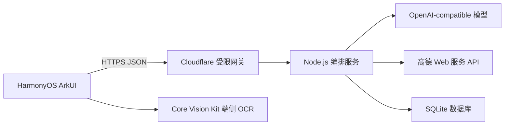

# 当前系统架构

## 端云拓扑



客户端只调用 `RestaurantAgentApi`、`AuthApi` 和受限网关。网关不承载业务逻辑，只转发白名单接口；Node 编排服务负责会话、数据、模型调用和固定流程约束。

## 业务状态机

```text
PRE_MEAL
  -> RESTAURANT_SELECTED
  -> ARRIVED
  -> MENU_READY
  -> DINING
  -> REVIEW
  -> END
```

评价前允许自然语言换店。换店查询是临时候选态：原 `session.stage`、已选餐厅和菜单版本保持不变；用户点击“不用换了”时客户端删除本次候选消息并恢复原节点 CTA，选择新餐厅才调用 `select_restaurant` 清空旧餐厅对话。

## 自然语言检索

`parseDiningIntent` 和模型解析器共同生成以下结构：

| 字段 | 示例 | 用途 |
|---|---|---|
| `restaurantNames` | 福味家宴 | 店名检索和精确加权 |
| `dishes` | 盐水鸭 | 菜品/菜单标签匹配 |
| `cuisines` | 江浙菜 | 菜系过滤和高德关键词 |
| `tastes` | 清淡、麻辣 | 标签过滤和排序 |
| `maxPrice` | 100 | 人均价格上限 |
| `maxDistanceKm` | 2 | 距离上限 |
| `minRating` | 4.5 | 评分下限 |
| `openNow` | true | 营业状态过滤 |

检索顺序为“模型/规则解析 → 高德文本或周边检索 → SQLite 候选合并 → 距离/评分/价格/营业硬过滤 → 店名/菜品/菜系/口味/用户偏好排序 → 模型生成简短回复”。模型只能从合法候选 ID 中排序，不能创建商家事实。

## 菜单与图片

高德地点搜索使用 `show_fields=business,photos`。商家首图和图片列表用于发现页、推荐卡和详情页。只有图片标题包含“菜单、菜谱、价目表、点菜单”时，详情页才会触发最多两张图片的视觉识别；普通环境图只展示，不进入菜单。

用户上传菜单时，客户端同时执行端侧 OCR 和图片压缩，服务端优先调用视觉模型；模型不可用时保留端侧 OCR。识别结果进入 `MENU_READY` 待确认版本，只有点击确认后才写入餐厅默认菜单。

## 认证、评论与资料

- 普通账号使用服务端账号密码接口。
- 华为账号使用服务端 OAuth 交换，不把 Client Secret 放入 App。
- 头像、昵称、籍贯、忌口、口味和菜系由统一资料接口保存。
- 商家详情支持直接评论；流程评价和详情评论均保存 `userId + createdAt + restaurantId + sessionId`，时间在界面按北京时间展示。
- 评论发布前进行手机号、邮箱和敏感内容处理。

## 数据边界

| 数据 | 来源 | 规则 |
|---|---|---|
| 餐厅基础信息 | 高德 API、SQLite 自有/授权目录 | 缺失字段不由模型补造 |
| 图片 | 高德 `photos` | HTTPS 图片；菜单候选需标题明确 |
| 菜单 | 自有/授权目录、端侧 OCR、视觉识别 | 低置信度必须确认 |
| 用户资料 | 账号接口 | Client Secret 和密码仅服务端 |
| 评论 | 用户输入 | 脱敏、按用户和时间戳独立保存 |

## 关键代码边界

- `entry/src/main/ets/pages/Index.ets`：三 Tab、聊天流、候选态、路由栈和详情页。
- `entry/src/main/ets/services/MenuImagePicker.ets`：图库、压缩和端侧 OCR。
- `server/src/orchestrator.js`：状态机、换店候选、菜单版本和模型编排。
- `server/src/recommendation.js`：意图兜底、硬过滤和排序。
- `server/src/amap.js`：高德 POI、营业状态、图片归一化。
- `server/src/app.js`：HTTP、认证、资料、评论和数据库写入。
