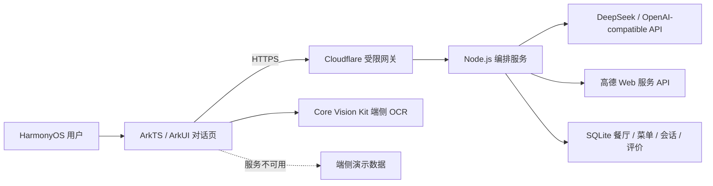

# 系统架构

## 模型参与节点

| 节点 | 模型职责 | 程序约束 |
|---|---|---|
| 用户输入 | 结构化解析菜系、口味、预算、营业要求 | JSON 字段归一化和长度/数值校验 |
| 推荐餐厅 | 在合法候选中重排并生成说明 | 高德/SQLite 先检索；只接受候选 ID |
| 选择餐厅 | 生成确认与下一步引导 | 服务端绑定 sessionId 和 restaurantId |
| 到店与菜单 | 结合偏好说明菜单、重排菜品；支持 GPT 图片识别 | 菜品必须来自数据库、模型视觉或端侧 OCR；过敏项先硬过滤 |
| 完成就餐 | 引导用户描述体验 | 状态机只允许进入 REVIEW |
| 评价 | 生成简洁回应 | 手机号/邮箱先脱敏，再绑定会话保存 |

端侧所有动作调用 `POST /v1/agent/execute`。服务端状态固定按 `PRE_MEAL → RESTAURANT_SELECTED → ARRIVED/MENU_READY → DINING → REVIEW → END` 推进，跳步动作返回 `INVALID_FLOW_TRANSITION`。未到店前可以更换餐厅，到店后不可回退选店。每个用户触发节点最多调用一次模型，模型只生成当前节点的短回复，不能修改状态或数据库记录。

菜单图片会同时携带端侧 Core Vision Kit OCR 结果和原图。服务端优先请求支持视觉的 OpenAI-compatible 模型并校验结构化菜单；模型超时、不支持图片或返回非法 JSON 时，直接采用端侧 OCR。两条路径都只允许在 `ARRIVED` 节点进入 `MENU_READY`。

## 数据边界

| 数据 | 来源 | 约束 |
|---|---|---|
| 餐厅基础信息 | 高德官方 API 或预置数据 | 缺失字段不由模型补造 |
| 菜单与食材 | 自有/授权菜单、端侧 OCR | 不使用未授权平台数据；低置信度提示用户 |
| 模型上下文 | 当前会话、有限候选和用户偏好 | API Key 仅在服务端；不发送用户手机号 |
| 评论 | 用户输入 | 保存前脱敏手机号和邮箱 |

`RestaurantAgentApi` 在网络失败时调用端侧 `MockAgent` 并明确提示降级。该路径只用于演示连续性，不代表模型已被调用。
